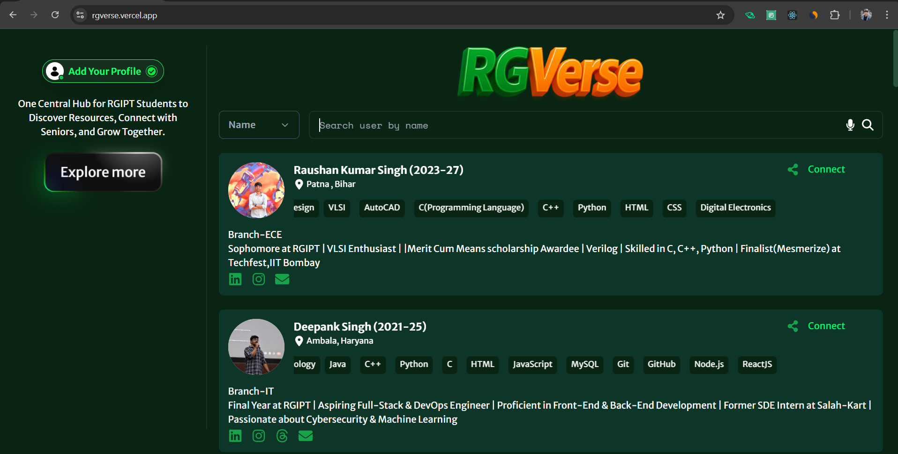

# 🚀 RGVerse: The Ultimate Hub for RGIPT Students



> **A student-driven platform empowering the RGIPT community to explore, learn, and grow together**

## 🌐 Live Project

**[https://rgverse.vercel.app/](https://rgverse.vercel.app/)**

## 🔍 What is RGVerse?

RGVerse is the central collaborative platform for Rajiv Gandhi Institute of Petroleum Technology (RGIPT) students. We connect students across batches, organize academic resources, and showcase student talent - all in one place.

### Our Mission

**Bridge the gap between students** by building a supportive knowledge-sharing ecosystem. Made by students, for students - helping everyone connect, collaborate, and excel.

## ✨ Key Features

### 📚 1. Notes & Resources

- Handwritten notes from seniors
- Previous Year Questions (PYQs)
- Must-watch YouTube playlists
- E-books and reference materials
- Semester-wise organized content

### 📄 2. Resume Builder

- Create ATS-friendly resumes
- Professionally designed templates
- Real student resume examples
- Industry-specific tips

### 🔧 3. Learning Resources

- Curated programming tools
- Technical libraries collections
- Skill development materials
- Workshop resources

### 🚀 4. Project Showcase

- Display your technical projects
- Receive constructive feedback
- Discover collaboration opportunities
- Inspire juniors with your work

### 💼 5. Opportunities Hub

- Internship listings
- Job opportunities
- Scholarship programs
- Competition announcements

### 🗺️ 6. Career Roadmaps

- Step-by-step learning paths
- Senior-curated tech tracks
- Industry-specific guidelines
- Skill development timelines

### 🌍 7. Open Source Programs

- Global open source opportunities
- GSOC and similar programs
- Contribution guidelines
- Project mentoring resources

### 💬 8. Discussion Forum

- Batch-specific channels
- Topic-wise discussions
- Project collaboration spaces
- Internship/course guidance

## 🛠️ How It Started

RGVerse was initiated by passionate RGIPT students who recognized the need for a structured platform where academic resources and student talent could be organized and showcased in one central location.

## 🤝 Contribution Guidelines

Read our [CONTRIBUTING.md](https://github.com/Piyush-t24/rgverse/blob/main/CONTRIBUTING.md)

## 📥 Installation & Setup

Follow these steps to set up RGVerse locally:

```bash
# 1. Clone the repository
git clone https://github.com/Piyush-t24/rgverse.git

# 2. Navigate to project directory
cd rgverse

# 3. Install dependencies
npm install

# 4. Start the development server
npm start

# 5. Open in browser
http://localhost:3000
```

## 📬 Contact Us

Have questions or suggestions? Get in touch with us:

Email: rgyerse2025@gmail.com
